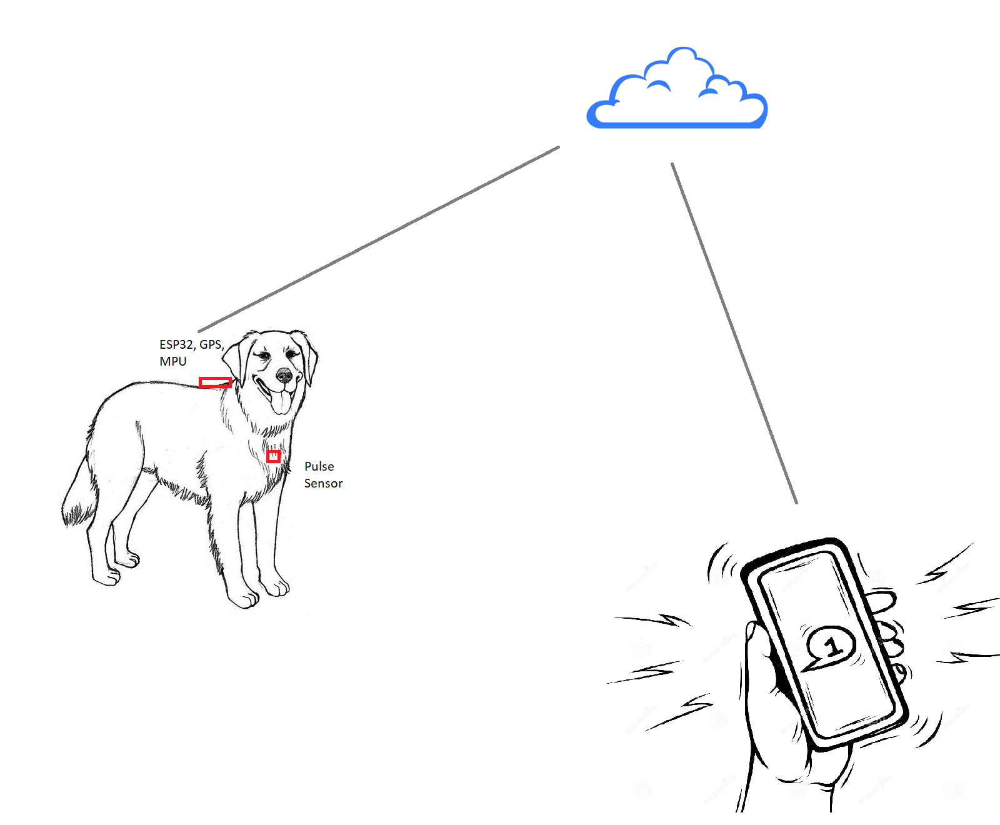
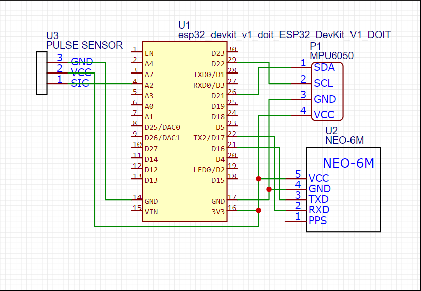

# oscar-sensor

Author: Dhruv Kurpad

For more details on how I built the sensor, check out the [docs blog](https://dhruv-kurpad.github.io/OscarProject-docs/)

This project is a dog harness with sensors to detect seizures in dogs. The repo contains all the code and assets needed to build the complete prototype. Please contact me if you want a completed harness. 

The harness is an off the shelf dog harness modified with a few sensors that can determine when a dog is having a seizure and notify me on a companion app.

The project contains the following components:
* Project to work with the MPU-6050 sensor and a ESP32 microcontroller
* Project to work with the Ne-6M GPS sensor and a ESP32 microcontroller
* Project to work with the pulse sensor and a ESP32 microcontroller
* Project to connect a ESP32 microcontroller to wifi and the send data to the cloud
* Completed project with schematics to connect all the sensors to the ESP32 and send data to the cloud
* iOS app that gets a push notification when a seizure is detected

## Getting Started
If you want to experiment with each sensor, use the sample projects and connect the sensor to the ESP32 as described in each of the sample experiments. For the completed project connect all the sensors to the harness like in the image.

## Components

* [PCB Prototype board](https://amzn.to/3p4UOvW)
* [ESP32 Microcontroller](https://amzn.to/3fyBxQs)
* [Neo-6M GPS](https://amzn.to/2SJ8L6M)
* [MPU-6050 Accelerometer Gyroscope](https://amzn.to/3ySikR8)
* [Pulse sensor](https://amzn.to/3vAY70s)
* [Connecting wires](https://amzn.to/3uA37kB)
* [Dog harness](https://amzn.to/3uBMfd5)
* 9V battery power supply
* [Buck Converter](https://amzn.to/3gcxdWj)

### MPU6050 Projects
The [MPU-6050 Accelerometer Gyroscope](https://amzn.to/3ySikR8) has 2 projects:
1. [ESP32-MPU6050](ESP32-MPU6050) In this project I read the accelerometer and gyroscope valuse directly from the device and calculate the orientation of the device.
2. [DMP](DMP) In this project I used the DMP onboard the MPU6050 to dtermine orientation based on the accelrometer and gyroscope. This was painful to setup and needed me to deit some of the library files to get it to work. The chanes needed are listed in the [changelog](DMP/Changes.txt)

### Neo6M GPS Project
The [ESP32-Neo-6M](ESP32-Neo-6M) project contains the code needed for the GPS to work. I did not add this compponent to the final solution, but plan to do so in the future.

### Pulse Sensor Project
I planned on using a pulse sensor to corelate the pulse data with the accelerometer to determine if I could predict the onset of a seizure as I noticed he was always panting before a seizure started. I had to drop this idea as I could not get a effective reading fromthe sensor when it was attached to the harness.
The [ESP32-PulseSensor](ESP32-PulseSensor) project has all the code needed to get this device working.

### Azure IOT Hub Project
I included the [ESP32-AzureIotHub](ESP32-AzureIotHub) project but decided not to use the IOT Hub and instead chose the simpler solution of connecting the sensor to an Azure Function.

### OscarSensor Project
The [OscarSensor](OscarSensor) project is the final project that I will be updating with improvements. The current version I have running for my dog takes a reading 10 times a second for 10 seconds and uploads the readings to the Azure Function.

### Cloud Settings

On the cloud I have a Azure Function that recieves the messages and determines if the dog is having a seizure based on a few threshold values. If a eizure is detected, the function calls a Logic App to send a notification (text message) to my phone.

## Environment and components
I bought most of the components needed from Amazon. For programming the components I chose to use PlatformIO as I am trying to experiment with more poewerful IDEs than the Arduino IDE.

### Connections

## Azure components

* [IoT Hub (free tier)](https://azure.microsoft.com/en-us/services/iot-hub/)
* [Azure Functions (free tier)](https://azure.microsoft.com/en-us/services/functions/)
* [Azure Logic App](https://azure.microsoft.com/en-us/services/logic-apps/)
* [Notification Hub](https://azure.microsoft.com/en-us/services/notification-hubs/)

The entire cloud setup dos not cost me more than $5/month to run this.

## Future plans

* Extending the app to enable geofencing with a home controller and a Lora module.
* Collect data from multiple sensors to look for patterns in predicting seizures
* Build an iOS app instead of a simple text message for notifications. For now this works.
* Use the sleep mode to save battery

## Resources

Here are some resources that I found very helpful!

* [ESP32 introduction on Dronebot Workshop](https://dronebotworkshop.com/esp32-intro/)
* [Introduction to PlatformIO on Dronebot Workshop](https://dronebotworkshop.com/platformio/)
[Working with the MPU 6050](https://randomnerdtutorials.com/esp32-mpu-6050-web-server/)
[Woking with the GPS module](https://blog.asksensors.com/iot-cloud-based-gps-tracking-esp32-gps-neo-6m-module/)
* [Connecting the ESP32 to the cloud](https://thingpulse.com/how-to-connect-your-esp32-to-the-azure-iot-cloud-over-rest/)
* [Using tasks with ESP32](https://www.youtube.com/watch?v=ywbq1qR-fY0)